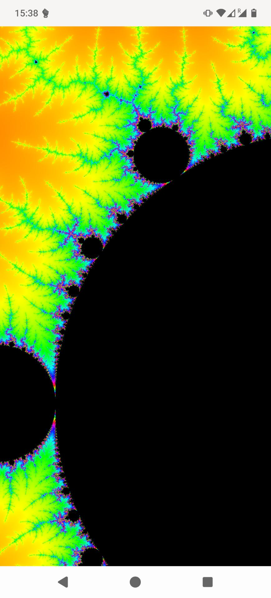

# GTK/Rust based viewer for the Mandelbrot set

To run it, get a recent version of Rust and GTK4 and run:

```bash
cargo run --release
```

Zooming can be done with the first mouse button, moving around with the second
mouse button.

### meson build

For building the application with [meson](https://mesonbuild.com/), you
need Meson's latest git `master` or the 1.11 release (not yet ready at
the time of this writing).

```bash
# Building
meson _builddir
ninja -C _builddir
# Running uninstalled
_builddir/mandelbrot
# Installing
ninja -C _builddir install
```

Cross compilation needs [mesonbuild#14952](https://github.com/mesonbuild/meson/pull/14952)

#### Android

Like applications written in C, with the meson build, mandelbrot can be
built for Android using [gtk-android-builder](https://github.com/sp1ritCS/gtk-android-builder/).
As applications for Android are produced using cross-compilation, this
also needs [mesonbuild#14952](https://github.com/mesonbuild/meson/pull/14952).

The manifest needed to build mandelbrot is located at
[build-aux/android/mandelbrot.xml](https://github.com/sdroege/mandelbrot/blob/master/build-aux/android/mandelbrot.xml).

> [!IMPORTANT]
> You currently have to modify `build-aux/android/rust.{cross,native}`
> to point to a rust compiler capable of building for android and your
> machine respectively.
>
> In the future, g-a-b might automatically generate those files based on
> a path to rustc passed to it during prepare.

To see how a build setup might look like, consult the
[GHA CI Pipeline](https://github.com/sdroege/mandelbrot/blob/master/.github/workflows/android.yml).

### Screenshot



